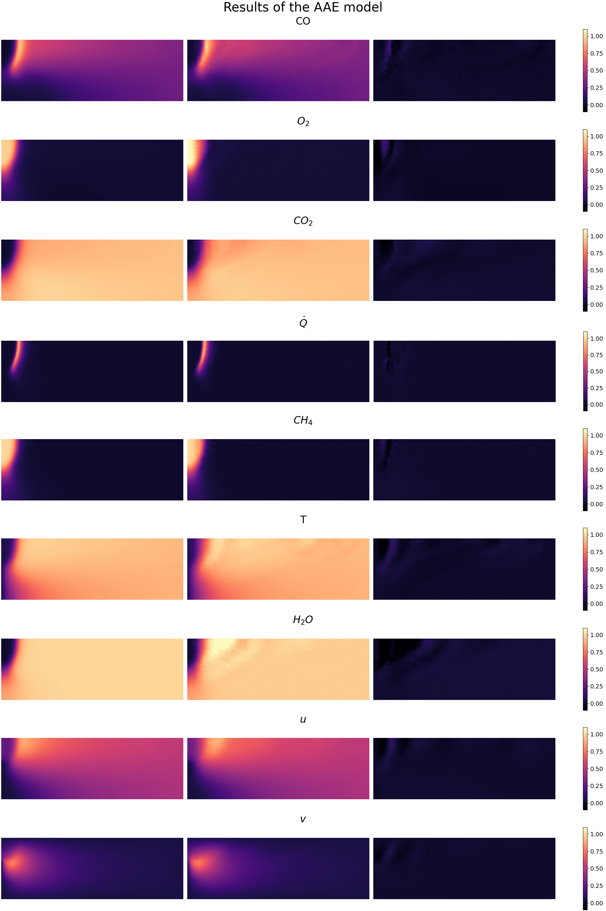
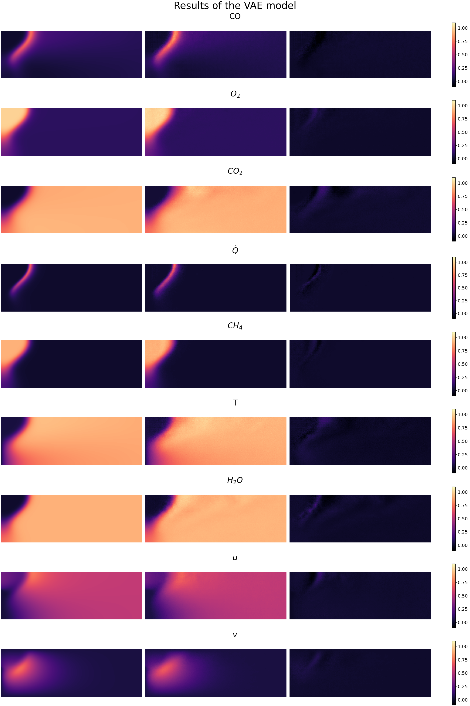
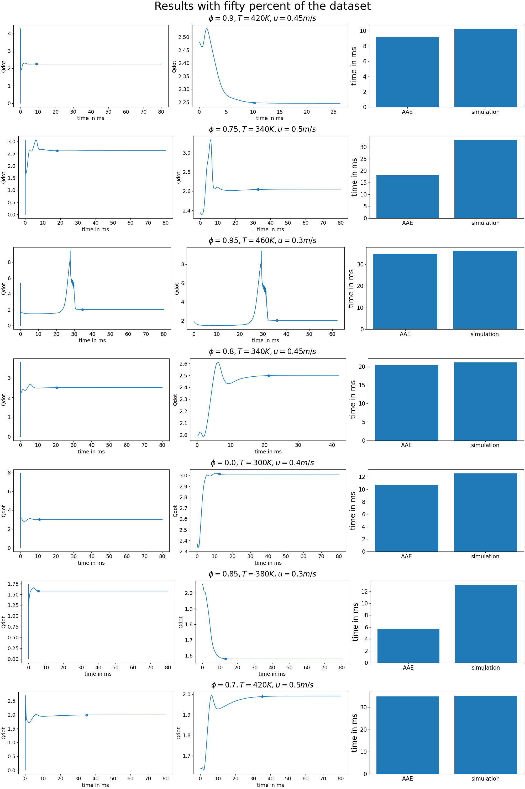

# Generative-models-for-combustion
GAN, VAE and AAE for prediction of a steady state flame

## Results of the models
The GAN networks did not converge, since the datast was too small with only 137 samples. The Autoencoders did work instead. 
They are combined with a neural network. The following predictions are from a validationb set and unseen for the model.

## Comparrison of the ML approach and a numeric simulation 
The goal was to speed up the process with ML. Therefor the model needs to perform better than a normal simulation. To test this hypothesis, the ML model predicted unseen flames. These predictions were then run by a numeric simulation. Since it is expensive to generate the training dataset, the ML model was tested with only 60 samples. Still iut did reduced the time required for stable flame images by roughly 20 percent. 
As complex numeric simulations can take days or even weeks to converge, this can be a huge time save.

